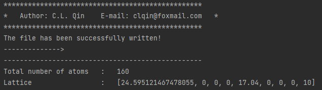

Usage
=====

##Installation

1.To use Pymatsci, first install pymatgen and numpy using pip:

.. code:: console

   pip install numpy
   pip install pymatgen

2.Install Pymatsci

.. code:: pyth

   pip install -i https://test.pypi.org/simple/ pymatsci

##Tutorials

This page presents a collection of tutorials.

###1. Nanostructure model

This page provides a series of tutorials on nanotube, graphene, and
magic graphene modeling.

1.1 Graphene
^^^^^^^^^^^^

(1) Input
'''''''''

.. code:: python

   from pymatsci.model import Graphene   # 导入石墨烯模块
   grap = Graphene(10, 0, 1.42, ['C'], 4)    # 输入手性参数、键长以及原子种类，默认是碳纳米管
   grap.write_vasp('./POSCAR')  # 输入存储的地址和文件名，产生vasp的输入文件
   # grap.write_lammps('./data.txt')   # 产生lammps的输入文件

(2) Output
''''''''''

The console will generate relevant information, such as the number of
atoms.

1.2 Magic Grapehe
^^^^^^^^^^^^^^^^^
