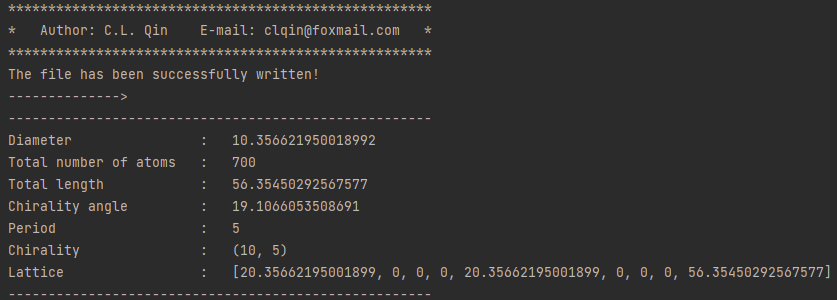

Usage
^^^^^

.. _installation:

Installation
------------

1.To use Pymatsci, first install pymatgen and numpy using pip:

.. code:: console

   pip install numpy
   pip install pymatgen

2.Install Pymatsci

.. code:: pyth

   pip install -i https://test.pypi.org/simple/ pymatsci

In addition, you can also visit `testpypi`_ to download.

.. _testpypi: https://test.pypi.org/project/pymatsci/

Tutorials
---------
This page presents a collection of tutorials.

1. Nanostructure model
>>>>>>>>>>>>>>>>>>>>>>
This page provides a series of tutorials on nanotube, graphene, and
magic graphene modeling.

1.1 Graphene
::::::::::::

**Input**

.. code:: python

   from pymatsci.model import Graphene        # 导入石墨烯模块
   model = Graphene(10, 0, 1.42, ['C'], 4)    # 输入手性参数、键长、原子种类以及周期
   model.write_vasp('./POSCAR')               # 输入存储的地址和文件名，产生vasp的输入文件
   # model.write_lammps('./data.txt')         # 产生lammps的输入文件

**Output**

Console:

.. figure:: usage/1.png
   :alt: 1

Generated model:

.. figure:: usage/2.png
   :alt: 2

1.2 Magic Grapehe
:::::::::::::::::

**Input**

.. code:: python

   from pymatsci.model import MagicGraphene         # 导入魔角石墨烯模块
   model = MagicGraphene(10, 5, 1.42, ['C'], 3.4)   # 输入手性参数、键长、原子种类以及层间距
   model.write_vasp('./POSCAR')
   # model.write_lammps('./data.txt')   

**Output**

Console:

.. figure:: usage/3.png
   :alt: 3

Generated model:

.. figure:: usage/4.png
   :alt: 4

1.2 Nanotube
::::::::::::

**Input**

.. code:: python

   from pymatsci.model import Nanotube       # 导入纳米管模块
   model = Nanotube(10, 5, 1.42, ['C'], 5)   # 输入手性参数、键长、原子种类以及周期
   model.write_vasp('./POSCAR')
   # model.write_lammps('./data.txt')   

**Output**

Console:

Generated model:

.. figure:: usage/6.png
   :alt: 6

 
