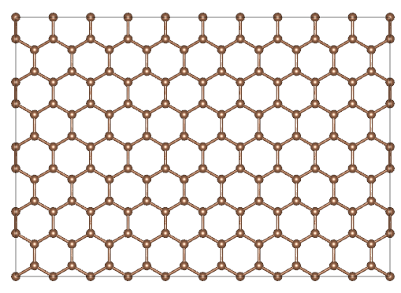

Tutorials
=========

This page presents a collection of tutorials.

1. Nanostructure model
>>>>>>>>>>>>>>>>>>>>>>

This page provides a series of tutorials on nanotube, graphene, and
magic graphene modeling.

1.1 Structural information of the model
:::::::::::::::::::::::::::::::::::::::

Both nanotubes and magic-angle graphene are built from single-layer graphene, and they have the same definition of chirality (n, m).

**Graphene**

Total number of atoms(N):

.. math::

   N = \frac{{2({n^2} + {m^2} + mn)p}}{{{g_1}}}

where g\ :sub:`1` is the greatest common divisor of n+2m and 2n+m, and p is the period.

**Magic-angle graphene**

Total number of atoms(N):

.. math::

   N = \frac{{4({n^2} + {m^2} + mn)p}}{{{g_1}}}

Magic angle(𝜃):

.. math::

   \theta  = ar\cos \frac{{{m^2} + {n^2} + 4mn}}{{2\sqrt {{m^2} + {n^2} + mn} }}

**Nanotube**

Total number of atoms(N):

.. math::

   N = \frac{{2({n^2} + {m^2} + mn)p}}{{{g_1}}}

Diameter(d):

.. math::

   d = \frac{{\sqrt {{m^2} + {n^2} + mn} }}{\pi }\sqrt 3 b

where b is the atomic bond length.

Total length(l):

.. math::

   l = \frac{{3 b\sqrt {{m^2} + {n^2} + mn} }}{{{g_1}}}

Chirality angle(𝜃):

.. math::

   \theta  = ar\cos (\frac{{2n + m}}{{2\sqrt {{m^2} + {n^2} + mn} }})

[1] E.J. Mele, Interlayer coupling in rotationally faulted multilayer graphenes, J Phys D Appl Phys 45 (15) (2012). 

[2] P. Moon, M. Koshino, Optical absorption in twisted bilayer graphene, Phys. Rev. B 87 (20) (2013). 

[3] S. Shallcross, S. Sharma, E. Kandelaki, O.A. Pankratov, Electronic structure of turbostratic graphene, Phys. Rev. B 81 (16) (2010). 

[4] M.S. Dresselhaus, G. Dresselhaus, R. Saito, Carbon fibers based on C60 and their symmetry, Phys Rev B Condens Matter 45 (11) (1992) 6234-6242. 

[5] C.T. White, D.H. Robertson, J.W. Mintmire, Helical and rotational symmetries of nanoscale graphitic tubules, Phys Rev B Condens Matter 47 (9) (1993) 5485-5488. 

1.2 Graphene
::::::::::::

**Input**

.. code:: python

   from pymatsci.model import Graphene        # 导入石墨烯模块
   model = Graphene(10, 0, 1.42, ['C'], 4)    # 输入手性参数、键长、原子种类以及周期
   model.write_vasp('./POSCAR')               # 输入存储的地址和文件名，产生vasp的输入文件
   # model.write_lammps('./data.txt')         # 产生lammps的输入文件

**Output**

Console:

.. figure:: tutorials/1.png
   :alt: 1

Generated model:

1.3 Magic-angle graphene
::::::::::::::::::::::::

**Input**

.. code:: python

   from pymatsci.model import MagicGraphene         # 导入魔角石墨烯模块
   model = MagicGraphene(10, 5, 1.42, ['C'], 3.4)   # 输入手性参数、键长、原子种类以及层间距
   model.write_vasp('./POSCAR')
   # model.write_lammps('./data.txt')   

**Output**

Console:

.. figure:: tutorials/3.png
   :alt: 3

Generated model:

.. figure:: tutorials/4.png
   :alt: 4

1.4 Nanotube
::::::::::::

**Input**

.. code:: python

   from pymatsci.model import Nanotube       # 导入纳米管模块
   model = Nanotube(10, 5, 1.42, ['C'], 5)   # 输入手性参数、键长、原子种类以及周期
   model.write_vasp('./POSCAR')
   # model.write_lammps('./data.txt')   

**Output**

Console:

.. figure:: tutorials/5.png
   :alt: 5

Generated model:

2. Thermal correction
>>>>>>>>>>>>>>>>>>>>>

2.1 Theory
::::::::::

Pymatsci uses a thermal correction similar to Gaussian, and the detailed thermodynamic derivation can be found in Atkins' Physical Chemistry.
The gases are assumed to be indistinguishable perfect gases with no interactions between them. The expressions for the internal energy (U) and entropy (S) of N molecules can be known from statistical thermodynamics:

.. math::

   U(T) = Nk{T^2}{\left( {\frac{{\partial \ln q}}{{\partial T}}} \right)_V}

.. math::

   S = \frac{U(T)}{T} + Nk\ln \frac{q}{N} + kN

where T is the temperature, V is the volume of the container, q is the partition function, and k is the Boltzmann constant. When considering only one molecule:

.. math::

   U(T) = k{T^2}{\left( {\frac{{\partial \ln q}}{{\partial T}}} \right)_V}

.. math::

   S = \frac{U(T)}{T} + Nk\ln q + k

Enthalpy (H) and Gibbs free energy (G) can be obtained from U and S:

.. math::

   H = U(T) + pV 

.. math::

   G = H - TS  

The expression for H seems to be a little trickier, since we don't know V. However, for an perfect gas, pV=kT. Therefore,

.. math::

   H = U(T) + kT

Considering the translational (q\ :sup:`t`), rotational (q\ :sup:`r`), vibrational (q\ :sup:`v`), and electron (q\ :sup:`e`) contributions we get

.. math::

   q = {q^t}{q^r}{q^v}{q^e}

The translational partition function is:

.. math::

   q^t = \frac{{(2{\pi}mkT)}^{3/2}}{h^3}V = \frac{{(2{\pi}mkT)}^{3/2}}{h^3}\frac{kT}p

where h is Planck's constant. Therefore,

The rotational partition function of a linear molecule (I\ :sub:`x` = 0, I\ :sub:`y` = I\ :sub:`z`) is

.. math::

   {q^r} = \frac{T}{{\sigma {\theta ^r}}}

.. math::

   {\theta ^r} = \frac{{{h^2}}}{{8{\pi ^2}Ik}}

where σ is the symmetry number, and I (I = I\ :sub:`y`) is the moment of inertia. The rotational partition function of the nonlinear molecule (I\ :sub:`x`, I\ :sub:`y`, I\ :sub:`z` != 0) is

.. math::

   q^r = \frac{{\pi}^{1/2}}{\sigma}\left(\frac{T^{3/2}}{(\theta _x^r\theta _y^r\theta _z^r)^{1/2}}\right)

The vibration partition function is

.. math::

   q^v = \prod\limits_k \frac{1}{1-{e^{-{hv/kT}}}} 

where v is the vibration frequency. Vibrational mode k=3n-5 for linear molecules and k=3n-6 for nonlinear molecules.

Electrons are generally in the ground state, so the partition function is

.. math::

   q^e = g

where g is the degeneracy of the electron ground state, or spin multiplicity.

Assuming that the volume of a single molecule is cubic, zero-point energy comes from translational (z\ :sup:`t`) and vibrational (z\ :sup:`v`) contributions

.. math::

   z^t = \frac{3{h^2}}{8mV^{2/3}} = \frac{3h^2}{8m{(kT/p)}^{2/3}}
   
.. math::

   z^v = \prod\limits_k 1/2hv

[1] P. Atkins, J. De Paula, J. Keeler, Physical Chemistry, 11 ed., Oxford University Press, London, 2018.

[2] https://gaussian.com/thermo/

2.1 Free gas
::::::::::::

**Input**

First you need to put CONTCAR and OUTCAR in the current folder.

.. code:: python

   from pymatsci.correction import ThermalCorrection   # 引入热学修正模块
   t = ThermalCorrection(298.15, 101325, True, 3)      # 输入温度(K)、压强(Pa)、是否线型分子，自旋多重度
   t.free_gas_correction()                             # 自由分子修正
   t.printout()                                        # 打印输出

**Output**

.. figure:: tutorials/7.png
   :alt: 7

