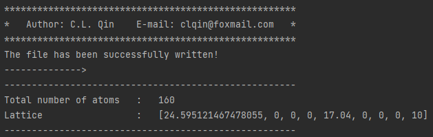
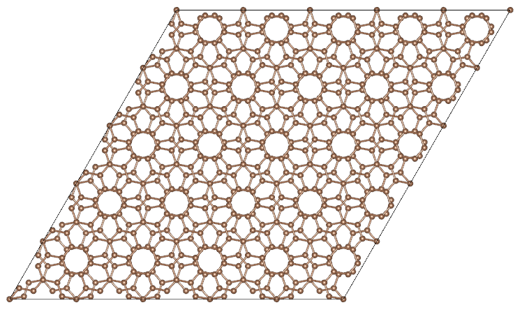
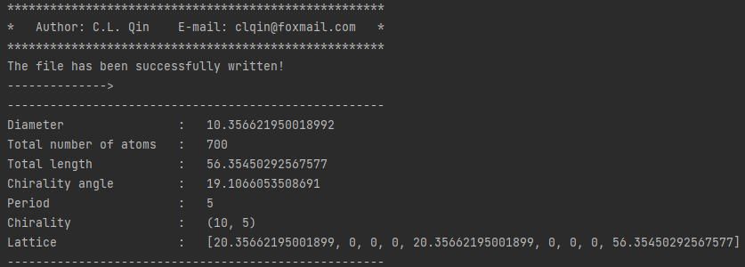

1. Model
>>>>>>>>

This page provides a series of tutorials on nanotube, graphene, and
magic graphene modeling.

1.1 Structural information of the model
:::::::::::::::::::::::::::::::::::::::

Both nanotubes and magic-angle graphene are built from single-layer graphene, and they have the same definition of chirality (n, m).

**Graphene**

Total number of atoms(N):

.. math::

   N = \frac{{2({n^2} + {m^2} + mn)p}}{{{g_1}}}

where g\ :sub:`1` is the greatest common divisor of n+2m and 2n+m, and p is the period.

**Magic-angle graphene**

Total number of atoms(N):

.. math::

   N = \frac{{4({n^2} + {m^2} + mn)p}}{{{g_1}}}

Magic angle(𝜃):

.. math::

   \theta  = ar\cos \frac{{{m^2} + {n^2} + 4mn}}{{2\sqrt {{m^2} + {n^2} + mn} }}

**Nanotube**

Total number of atoms(N):

.. math::

   N = \frac{{2({n^2} + {m^2} + mn)p}}{{{g_1}}}

Diameter(d):

.. math::

   d = \frac{{\sqrt {{m^2} + {n^2} + mn} }}{\pi }\sqrt 3 b

where b is the atomic bond length.

Total length(l):

.. math::

   l = \frac{{3 b\sqrt {{m^2} + {n^2} + mn} }}{{{g_1}}}

Chirality angle(𝜃):

.. math::

   \theta  = ar\cos (\frac{{2n + m}}{{2\sqrt {{m^2} + {n^2} + mn} }})

[1] E.J. Mele, Interlayer coupling in rotationally faulted multilayer graphenes, J Phys D Appl Phys 45 (15) (2012). 

[2] P. Moon, M. Koshino, Optical absorption in twisted bilayer graphene, Phys. Rev. B 87 (20) (2013). 

[3] S. Shallcross, S. Sharma, E. Kandelaki, O.A. Pankratov, Electronic structure of turbostratic graphene, Phys. Rev. B 81 (16) (2010). 

[4] M.S. Dresselhaus, G. Dresselhaus, R. Saito, Carbon fibers based on C60 and their symmetry, Phys Rev B Condens Matter 45 (11) (1992) 6234-6242. 

[5] C.T. White, D.H. Robertson, J.W. Mintmire, Helical and rotational symmetries of nanoscale graphitic tubules, Phys Rev B Condens Matter 47 (9) (1993) 5485-5488. 

1.2 Graphene
::::::::::::

**Input**

.. code:: python

   from pymatsci.model import Graphene        # 导入石墨烯模块
   model = Graphene(10, 0, 1.42, ['C'], 4)    # 输入手性参数、键长、原子种类以及周期
   model.write_vasp('./POSCAR')               # 输入存储的地址和文件名，产生vasp的输入文件
   # model.write_lammps('./data.txt')         # 产生lammps的输入文件

**Output**

Console:

Generated model:

.. figure:: model/2.png
   :alt: 2

1.3 Magic-angle graphene
::::::::::::::::::::::::

**Input**

.. code:: python

   from pymatsci.model import MagicGraphene         # 导入魔角石墨烯模块
   model = MagicGraphene(10, 5, 1.42, ['C'], 3.4)   # 输入手性参数、键长、原子种类以及层间距
   model.write_vasp('./POSCAR')
   # model.write_lammps('./data.txt')   

**Output**

Console:

.. figure:: model/3.png
   :alt: 3

Generated model:

1.4 Nanotube
::::::::::::

**Input**

.. code:: python

   from pymatsci.model import Nanotube       # 导入纳米管模块
   model = Nanotube(10, 5, 1.42, ['C'], 5)   # 输入手性参数、键长、原子种类以及周期
   model.write_vasp('./POSCAR')
   # model.write_lammps('./data.txt')   

**Output**

Console:

Generated model:

.. figure:: model/6.png
   :alt: 6