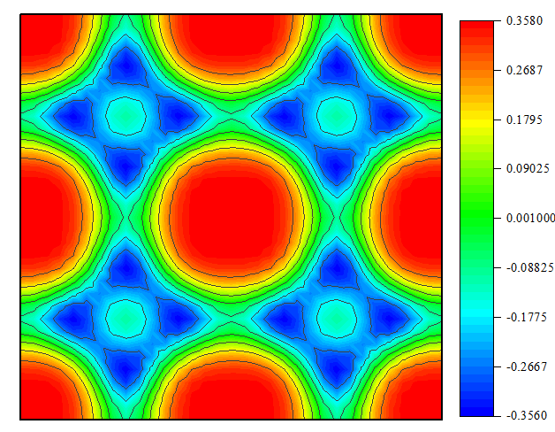

3. Surface
>>>>>>>>>>

This page provides a series of tutorials on surface and adsorption.

3.1 Structural information of surface
:::::::::::::::::::::::::::::::::::::

**Input**

First you need to provide POSCAR and CONTCAR.

.. code:: python
	
	from pymatsci.surface import get_surf_info   
	get_surf_info([21, 22])   # 输入吸附原子索引，没有则为空

**Output**

3.2 Adsorption potential energy surface
:::::::::::::::::::::::::::::::::::::::

3.2.1 Generate model file
"""""""""""""""""""""""""
	
**Input**

First create a folder named PES in the current folder.

Second, you need to provide POSCAR, INCAR, POTCAR, KPOINTS and the submission file vasp.pbs in the PES folder.

.. code:: python
	
	from pymatsci.surface import generate_grid   
	# 输入提交脚本，在xy方向的超胞数以及网格数，还要输入吸附原子的序数（可通过VESTA可查看）
	generate_grid('vasp.pbs', 2, 2, 16, 16, 21)      

**Output**

.. figure:: surface/2.png
   :alt: 2

Finally, you can drag the created folder into the server for calculation.

3.2.2 Extract data
"""""""""""""""""""

First make sure the PES folder is empty, then drag the calculated data folder from the server into the PES folder.

.. code:: python
	
	from pymatsci.surface import extract_data   
	#  输入在xy方向的超胞数以及干净表面和单个吸附原子的能量总和
	extract_data(2, 2, -215.8)          

Then a data file named data.txt will be generated in the current folder，and drag it into origin to draw

3.3 Generate all surfaces with a given maximum Miller index
:::::::::::::::::::::::::::::::::::::::::::::::::::::::::::

.. code:: python

	from pymatsci.surface import generate_all_surfs
	# 输入要切的晶体结构， 最大miller_index，表面层数，是否写入表面，是否写入表面的晶胞
	generate_all_surfs('CONTCAR', 2, 1, 15, write_surf=True, write_unit_cell=True)

**Output**

.. figure:: surface/5.png
   :alt: 5