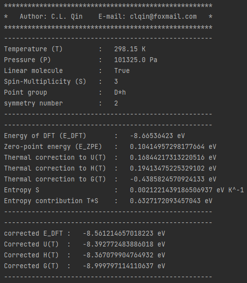

2. Thermal correction
>>>>>>>>>>>>>>>>>>>>>

2.1 Theory
::::::::::

Pymatsci uses a thermal correction similar to Gaussian, and the detailed thermodynamic derivation can be found in Atkins' Physical Chemistry.
The gases are assumed to be indistinguishable perfect gases with no interactions between them. The expressions for the internal energy (U) and entropy (S) of N molecules can be known from statistical thermodynamics:

.. math::

   U = Nk{T^2}{\left( {\frac{{\partial \ln q}}{{\partial T}}} \right)_V}

.. math::

   S =NkT{\left( {\frac{{\partial \ln q}}{{\partial T}}} \right)_V} + Nk\ln \frac{q}{N} + kN

where T is the temperature, V is the volume of the container, q is the partition function, and k is the Boltzmann constant. When considering only one molecule:

.. math::

   U = k{T^2}{\left( {\frac{{\partial \ln q}}{{\partial T}}} \right)_V}

.. math::

   S =kT{\left( {\frac{{\partial \ln q}}{{\partial T}}} \right)_V} + k\ln q + k

Considering the translational (q\ :sup:`t`), rotational (q\ :sup:`r`), vibrational (q\ :sup:`v`), and electron (q\ :sup:`e`) contributions we get

.. math::

   q = {q^t}{q^r}{q^v}{q^e}

Therefore,

.. math::

   U = {\sum\limits_i {k{T^2}\left( {\frac{{\partial \ln {q_i}}}{{\partial T}}} \right)} _V} = {U_t} + {U_r} + {U_v} + {U_e}

.. math::

   S = {\sum\limits_i {kT\left( {\frac{{\partial \ln {q_i}}}{{\partial T}}} \right)} _V} + k\ln {q_i} = {S_t} + {S_r} + {S_v} + {S_e} + k

Enthalpy (H) and Gibbs free energy (G) can be obtained from U and S:

.. math::

   H = U + pV 

.. math::

   G = H - TS  

The expression for H seems to be a little trickier, since we don't know V. However, for an perfect gas, pV=kT. Therefore,

.. math::

   H = U + kT

The translational partition function is:

.. math::

   q^t = \frac{{(2{\pi}mkT)}^{3/2}}{h^3}V = \frac{{(2{\pi}mkT)}^{3/2}}{h^3}\frac{kT}p

where h is Planck's constant and m is the molecular mass. 

The rotational partition function of a linear molecule (I\ :sub:`x` = 0, I\ :sub:`y` = I\ :sub:`z`) is

.. math::

   {q^r} = \frac{T}{{\sigma {\theta ^r}}}

.. math::

   {\theta ^r} = \frac{{{h^2}}}{{8{\pi ^2}Ik}}

where σ is the symmetry number, and I (I = I\ :sub:`y`) is the moment of inertia. The rotational partition function of the nonlinear molecule (I\ :sub:`x`, I\ :sub:`y`, I\ :sub:`z` != 0) is

.. math::

   q^r = \frac{{\pi}^{1/2}}{\sigma}\left(\frac{T^{3/2}}{(\theta _x^r\theta _y^r\theta _z^r)^{1/2}}\right)

The vibration partition function is

.. math::

   q^v = \prod\limits_f \frac{1}{1-{e^{-{hv/kT}}}} 

where v is the vibration frequency and f is the vibrational degrees of freedom of the molecule. 

Electrons are generally in the ground state, so the partition function is

.. math::

   q^e = g

where g is the degeneracy of the electron ground state, or spin multiplicity.

Zero-point energy (z=z\ :sup:`t` + z\ :sup:`v`) comes from translational (z\ :sup:`t`) and vibrational (z\ :sup:`v`) contributions. However, the zero-point energy of the translational contribution is negligible, so

.. math::

   z \approx z^v = \prod\limits_f 1/2hv

At last, pymatsci will output the corrected DFT energy (E\ :sub:`DFT, c`), internal energy (U\ :sub:`c`), enthalpy (H\ :sub:`c`) and Gibbs free (G\ :sub:`c`),  

.. math::

   E_{DFT, c} = E_{DFT} + z 

.. math::

   U_c = E_{DFT, c} + U

.. math::

   H_c = E_{DFT, c} + H

.. math::

   G_c = E_{DFT, c} + G

where E\ :sub:`DFT` is the energy of density functional calculations.

[1] P. Atkins, J. De Paula, J. Keeler, Physical Chemistry, 11 ed., Oxford University Press, London, 2018.

[2] https://gaussian.com/thermo/

[3] V. Wang, N. Xu, J.C. Liu, G. Tang, W.T. Geng, VASPKIT: A User-Friendly Interface Facilitating High-Throughput Computing and Analysis Using VASP Code, Computer Physics Communications 267, 108033 (2021).

2.1 Free gas
::::::::::::

For free gases, consider translational, rotational, vibrational and electron contributions. For linear molecules, degree of vibrational freedom is 3n - 5, Pymatsci will neglect smallest 5 frequencies. For non-linear molecules, degree of vibrational freedom is 3n - 6,Pymatsci will neglect smallest 6 frequencies. n is the atomic number of the molecule.

**Input**

First you need to put CONTCAR and OUTCAR in the current folder.

.. code:: python

   from pymatsci.correction import FreeGasCorrection   # 引入热学修正模块
   t = FreeGasCorrection(298.15, 101325, True, 3)      # 输入温度(K)、压强(Pa)、是否线型分子，自旋多重度
   t.correction()                             # 自由分子修正
   t.printout()                                        # 打印输出

**Output**

2.2 Adsorbed gas
::::::::::::::::

For adsorbed molecules, pymatsci uses the calculation method of vaspkit. Unlike gas molecules, adsorbed molecules form chemical bonds with substrate, which limits the translational and rotational freedom of the adsorbed molecules. So the contribution of translation and rotation to entropy and enthalpy is significantly reduced (so called hindered translator / hindered rotor model). This does not mean no translational or rotational contribution.

One common method is to attribute the translational or rotational part of the contribution to vibration, that is, the 3n vibrations of the surface-adsorbing molecules (except the virtual frequency) are all used to calculate the correction of the thermo energy. Pymatsci neglects the electron motion because of its small contribution and pV can be ignored in condensed phase. Therefore,

.. math::

   H = U = U_v

.. math::

   S = {S_v} + k

The small the vibration frequencies have large contribution to entropy. It is very likely that a small vibration frequency will lead to abnormal entropy and free energy correction. So, it suggests that when the free energy of the surface adsorption molecule is corrected, the contribution of the frequency below 50 cm\ :sup:`-1` is calculated as 50 cm\ :sup:`-1`, and pymatsci also does this. 

**Input**

First fix all slab atoms, do frequency calculation for the adsorbed molecule.

Then, you need to put CONTCAR and OUTCAR in the current folder.

.. code:: python

   from pymatsci.correction import AdsorbedGasCorrection  
   a = AdsorbedGasCorrection(298.15)                      # 输入温度(K)
   a.correction()                                         # 吸附分子修正
   a.printout()                                           # 打印输出

**Output**

 
