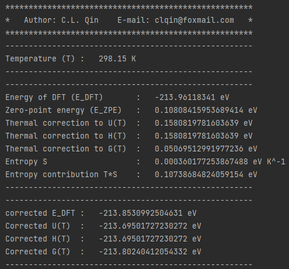
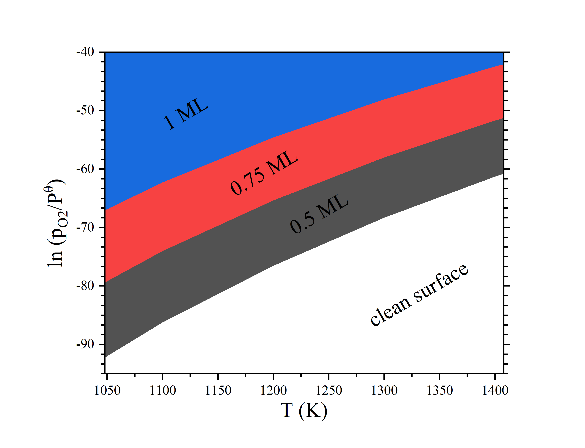
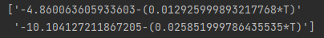

2. Thermodynamics
>>>>>>>>>>>>>>>>>>>>>

2.1 Thermodynamic correction
::::::::::::::::::::::::::::

2.1.1 Theory
''''''''''''

Pymatsci uses a thermal correction similar to Gaussian, and the detailed thermodynamic derivation can be found in Atkins' Physical Chemistry.
The gases are assumed to be indistinguishable perfect gases with no interactions between them. The expressions for the internal energy (U) and entropy (S) of N molecules can be known from statistical thermodynamics:

.. math::

   U = Nk{T^2}{\left( {\frac{{\partial \ln q}}{{\partial T}}} \right)_V}

.. math::

   S =NkT{\left( {\frac{{\partial \ln q}}{{\partial T}}} \right)_V} + Nk\ln \frac{q}{N} + kN

where T is the temperature, V is the volume of the container, q is the partition function, and k is the Boltzmann constant. When considering only one molecule:

.. math::

   U = k{T^2}{\left( {\frac{{\partial \ln q}}{{\partial T}}} \right)_V}

.. math::

   S =kT{\left( {\frac{{\partial \ln q}}{{\partial T}}} \right)_V} + k\ln q + k

Considering the translational (q\ :sup:`t`), rotational (q\ :sup:`r`), vibrational (q\ :sup:`v`), and electron (q\ :sup:`e`) contributions we get

.. math::

   q = {q^t}{q^r}{q^v}{q^e}

Therefore,

.. math::

   U = {\sum\limits_i {k{T^2}\left( {\frac{{\partial \ln {q_i}}}{{\partial T}}} \right)} _V} = {U_t} + {U_r} + {U_v} + {U_e}

.. math::

   S = {\sum\limits_i {kT\left( {\frac{{\partial \ln {q_i}}}{{\partial T}}} \right)} _V} + k\ln {q_i} + k = {S_t} + {S_r} + {S_v} + {S_e} + k

Enthalpy (H) and Gibbs free energy (G) can be obtained from U and S:

.. math::

   H = U + pV 

.. math::

   G = H - TS  

The expression for H seems to be a little trickier, since we don't know V. However, for an perfect gas, pV=kT. Therefore,

.. math::

   H = U + kT

The translational partition function is:

.. math::

   q^t = \frac{{(2{\pi}mkT)}^{3/2}}{h^3}V = \frac{{(2{\pi}mkT)}^{3/2}}{h^3}\frac{kT}p

where h is Planck's constant and m is the molecular mass. 

The rotational partition function of a linear molecule (I\ :sub:`x` = 0, I\ :sub:`y` = I\ :sub:`z`) is

.. math::

   {q^r} = \frac{T}{{\sigma {\theta ^r}}}

.. math::

   {\theta ^r} = \frac{{{h^2}}}{{8{\pi ^2}Ik}}

where σ is the symmetry number, and I (I = I\ :sub:`y`) is the moment of inertia. The rotational partition function of the nonlinear molecule (I\ :sub:`x`, I\ :sub:`y`, I\ :sub:`z` != 0) is

.. math::

   q^r = \frac{{\pi}^{1/2}}{\sigma}\left(\frac{T^{3/2}}{(\theta _x^r\theta _y^r\theta _z^r)^{1/2}}\right)

The vibration partition function is

.. math::

   q^v = \prod\limits_f \frac{1}{1-{e^{-{hv/kT}}}} 

where v is the vibration frequency and f is the vibrational degrees of freedom of the molecule. 

Electrons are generally in the ground state, so the partition function is

.. math::

   q^e = g

where g is the degeneracy of the electron ground state, or spin multiplicity.

Zero-point energy (z=z\ :sup:`t` + z\ :sup:`v`) comes from translational (z\ :sup:`t`) and vibrational (z\ :sup:`v`) contributions. However, the zero-point energy of the translational contribution is negligible, so

.. math::

   z \approx z^v = \prod\limits_f 1/2hv

At last, pymatsci will output the corrected DFT energy (E\ :sub:`DFT, c`), internal energy (U\ :sub:`c`), enthalpy (H\ :sub:`c`) and Gibbs free (G\ :sub:`c`),  

.. math::

   E_{DFT, c} = E_{DFT} + z 

.. math::

   U_c = E_{DFT, c} + U

.. math::

   H_c = E_{DFT, c} + H

.. math::

   G_c = E_{DFT, c} + G

where E\ :sub:`DFT` is the energy of density functional calculations.

[1] P. Atkins, J. De Paula, J. Keeler, Physical Chemistry, 11 ed., Oxford University Press, London, 2018.

[2] https://gaussian.com/thermo/

[3] V. Wang, N. Xu, J.C. Liu, G. Tang, W.T. Geng, VASPKIT: A User-Friendly Interface Facilitating High-Throughput Computing and Analysis Using VASP Code, Computer Physics Communications 267, 108033 (2021).

2.1.1 Free gas
''''''''''''''

For free gases, consider translational, rotational, vibrational and electron contributions. For linear molecules, degree of vibrational freedom is 3n - 5, Pymatsci will neglect smallest 5 frequencies. For non-linear molecules, degree of vibrational freedom is 3n - 6,Pymatsci will neglect smallest 6 frequencies. n is the atomic number of the molecule.

**Input**

First you need to put CONTCAR and OUTCAR in the current folder.

.. code:: python

   from pymatsci.thermodynamics import FreeGasCorrection   # 引入热学修正模块
   t = FreeGasCorrection(298.15, 101325, True, 3)      # 输入温度(K)、压强(Pa)、是否线型分子，自旋多重度
   t.correction()                             # 自由分子修正
   t.printout()                                        # 打印输出

**Output**

.. figure:: thermodynamics/1.png
   :alt: 1

2.1.2 Adsorbed gas
''''''''''''''''''

For adsorbed molecules, pymatsci uses the calculation method of vaspkit. Unlike gas molecules, adsorbed molecules form chemical bonds with substrate, which limits the translational and rotational freedom of the adsorbed molecules. So the contribution of translation and rotation to entropy and enthalpy is significantly reduced (so called hindered translator / hindered rotor model). This does not mean no translational or rotational contribution.

One common method is to attribute the translational or rotational part of the contribution to vibration, that is, the 3n vibrations of the surface-adsorbing molecules (except the virtual frequency) are all used to calculate the correction of the thermo energy. Pymatsci neglects the electron motion because of its small contribution and pV can be ignored in condensed phase. Therefore,

.. math::

   H = U = U_v

.. math::

   S = {S_v} + k

The small the vibration frequencies have large contribution to entropy. It is very likely that a small vibration frequency will lead to abnormal entropy and free energy correction. So, it suggests that when the free energy of the surface adsorption molecule is corrected, the contribution of the frequency below 50 cm\ :sup:`-1` is calculated as 50 cm\ :sup:`-1`, and pymatsci also does this. 

**Input**

First fix all slab atoms, do frequency calculation for the adsorbed molecule.

Then, you need to put CONTCAR and OUTCAR in the current folder.

.. code:: python

   from pymatsci.thermodynamics import AdsorbedGasCorrection  
   a = AdsorbedGasCorrection(298.15)                      # 输入温度(K)
   a.correction()                                         # 吸附分子修正
   a.printout()                                           # 打印输出

**Output**

2.2 Ab initio thermodynamics
::::::::::::::::::::::::::::

2.2.1 Theory
''''''''''''

The energy calculated by DFT only gives the energy at zero temperature (T) and zero pressure (p). However, for the real reaction conditions, the interaction of O2 molecules with the U surface requires the consideration of temperature and O2 pressure, which is achieved by using the "ab initio thermodynamics" approach. The Gibbs free energy of adsorption considering temperature and pressure can be described as

.. math::

   {G_{{\rm{ads}}}} = {G_{adsorbate{\rm{s}}/slab}} - {G_{slab}} - {\rm{n}}{G_{adsorbates}}  (1)

where n is the number of adsorbates, Gadsorbates/slab is the Gibbs free energy of the adsorbates/slab system, Gslab is the Gibbs free energy of the slab, and Gadsorbates is the Gibbs free energy of the adsorbates.
The energy calculated by DFT (E) is related to a thermodynamical quantity only in a restricted way, corresponding to the Gibbs free energy at zero temperature and neglecting zero-point vibrations. It is known from physical chemistry that Gibbs free energy can thus be written as
     
.. math::

   G(T,{\rm{p}}) = E + U(T,{\rm{p}}) + pV - TS(T,p)  (2)

In general, the volume effect and the vibration contribution to the Gibbs free energy of the condensed phase are small. On the other hand, for adsorption systems, the adsorption of gas molecules will not significantly change the vibrational modes of the surface, and the contributions from temperature and pressure will be canceled. Therefore, equation (3) can be written as
     
.. math::
     
   {G_{{\rm{ads}}}} = {E_{adsorbate{\rm{s}}/slab}} - {E_{slab}} - {\rm{n}}{G_{adsorbates}}   (3)

Here is an example of oxygen molecule. The adsorbates considered are O atoms whose chemical potential is half that of gaseous O2 molecules. Assuming that the adsorbed gas is the perfect molecule, the chemical potential of the O atom can be expressed as
      
.. math::
   {\mu _O} = \frac{1}{2}{\mu _{{{\rm{O}}_2}}}(T,p) = \frac{1}{2}\left( {{E_{{O_2}}} + {\mu _{{{\rm{O}}_2}}}(T,{p^\theta }) + kT\ln \left( {\frac{{{p_{{O_2}}}}}{{{p^\theta }}}} \right)} \right)   (4)

where k is the Boltzmann constant. Equation (3) can be further written as

.. math::

   \begin{array}{c}
   {G_{{\rm{ads}}}} = {E_{O/slab}} - {E_{slab}} - n{\mu _O}\\
    = {E_{O/slab}} - {E_{slab}} - \frac{n}{2}{E_{{O_2}}} - \frac{{\rm{n}}}{2}\left( {{\mu _{{O_2}}}(T,{p^\theta }) + kT\ln (\frac{{{p_{{O_2}}}}}{{{p^\theta }}})} \right)\\
    = {E_{ads}} - \frac{{\rm{n}}}{2}\left( {{\mu _{{O_2}}}(T,{p^\theta }) + kT\ln (\frac{{{p_{{O_2}}}}}{{{p^\theta }}})} \right)
   \end{array} (7)

where Eads is the adsorption energy at 0 K.

[1] K. Reuter, M. Scheffler, Composition, structure, and stability ofRuO2(110)as a function of oxygen pressure, Phys. Rev. B 65 (3) (2001).

[2] P. Maldonado, L.Z. Evins, P.M. Oppeneer, Ab Initio Atomistic Thermodynamics of Water Reacting with Uranium Dioxide Surfaces, The Journal of Physical Chemistry C 118 (16) (2014) 8491-8500.

2.2.2 Phase Diagrams (T-p)
''''''''''''''''''''''''''

.. code:: python
   
   from pymatsci.thermodynamics import Abthermodynamics
   import numpy as np
   t = Abthermodynamics('https://janaf.nist.gov/tables/O-029.html')
   # 多次重复计算不同的数据，综合比较得到最终的相图
   data1 = t.get_Tp(3/2, -16.351, 4/2, -18.881)  # 输入覆盖度，吸附能，覆盖度，吸附能
   data2 = t.get_Tp(3 / 2, -16.351, 0, 0)  # 输入覆盖度，吸附能，覆盖度，吸附能
   data = np.hstack((data1, data2))
   # np.savetxt('data.txt', data)  # 保存数据

**Output**

2.2.3 Phase Diagrams (T)
''''''''''''''''''''''''

.. code:: python

   from pymatsci.thermodynamics import Abthermodynamics
   import numpy as np
   t = Abthermodynamics('https://janaf.nist.gov/tables/O-029.html')
   data1 = t.get_T(1/2, -5.134, 0.21)  # 输入覆盖度，吸附能，气体分压
   data2 = t.get_T(2/2, -10.652, 0.21)  # 输入覆盖度，吸附能，气体分压
   data = np.hstack((data1, data2))
   # np.savetxt('data.txt', data)  # 保存数据

**Output**

.. figure:: thermodynamics/4.png
   :alt: 4

2.2.4 Phase Diagrams (p)
''''''''''''''''''''''''

.. code:: python

   from pymatsci.thermodynamics import Abthermodynamics
   import numpy as np
   t = Abthermodynamics('https://janaf.nist.gov/tables/O-029.html')
   data1 = t.get_p(1/2, -5.134, 300)  # 输入覆盖度，吸附能，温度
   data2 = t.get_p(2/2, -10.652, 300)  # 输入覆盖度，吸附能，温度
   data = np.hstack((data1, data2))
   print(data)  # 打印结果

**Output**

